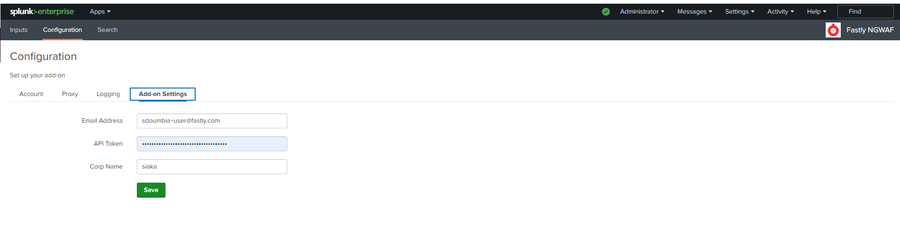
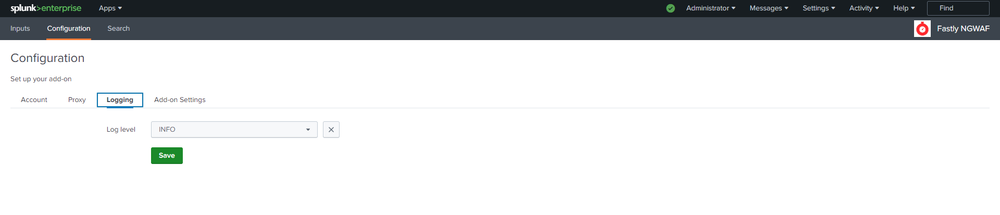
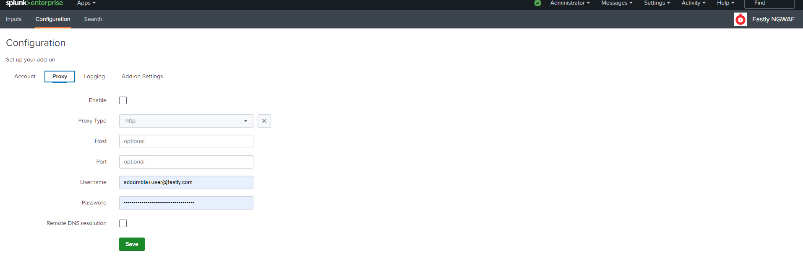
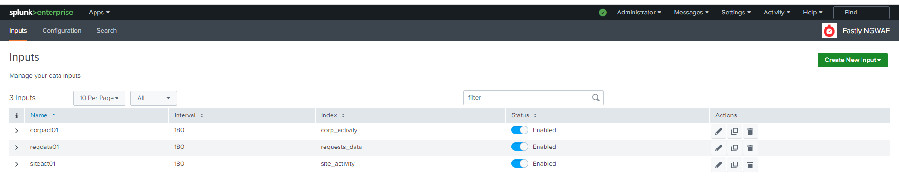
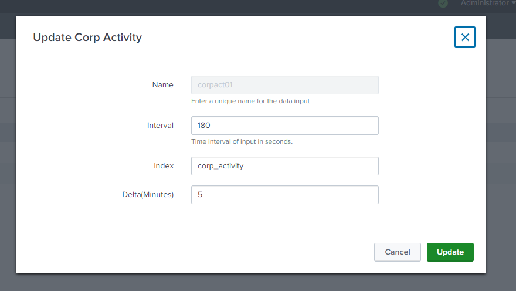
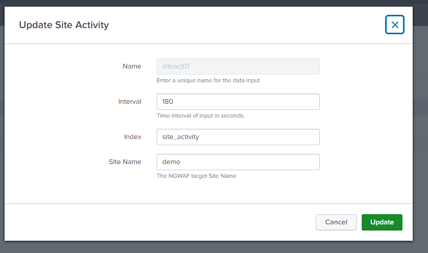
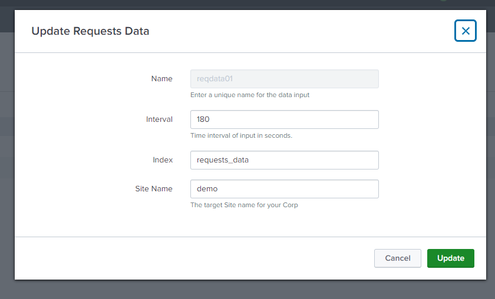
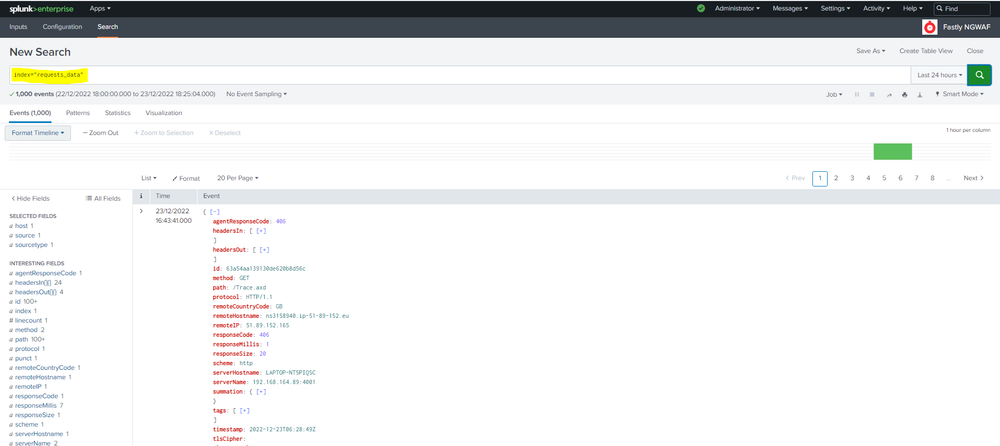

# Fastly NGWAF(Next-Gen WAF) TA for Splunk App

This app is a Technology Add-on that collects data from the Next-Gen WAF.
It collects activity data at corp level, site level and from the request feed.

## Fastly NGWAF(Next-Gen WAF) API calls equivalent

1. https://dashboard.signalsciences.net/api/v0/corps/{{corp}}/activity
2. https://dashboard.signalsciences.net/api/v0/corps/{{corp}}/sites/{{site}}/analytics/events
3. https://dashboard.signalsciences.net/api/v0/corps/{{corp}}/sites/{{site}}/feed/requests

## Installation steps 

1. download the tgz file at SplunkBase https://splunkbase.com/xxxxxx
2. Install In Splunk 
3. Configure Indexes related to each API calls or group into one index( a sample indexes.conf name indexes.conf.sample can be found under $SPLUNK_HOME/etc/apps/TA-fastly-ngwaf/local )

## Configuration Steps
1. Click on the app , go to Configuration > Add-on Settings and Enter your email address, console generated API token and Corp name.
   * **Email Address:** This is the username/email address for the NGWAF dashboard ( Required )
   * **API Token:** Required if you are **not using** your password ( Required )
   * **Corp Name** This is your Corp Name short name in your console ( Required )
  
     

2. The logging and Account tab are not currently functional ( leave as is)
     

3. The proxy function has not been tested so please feel free to send us feedback should you have any
     

4. Click on "Create New Input"  
     
     
5. Enter the corresponding values in the prompt 
       
      ### Corp activity
      Enter a unique name for the data input , an interval of data polling , choose and index and leave the Delta(Minutes) value as is.
           
      
      
      ### Site activity      
      Enter a unique name for the data input , an interval of data polling( in seconds) , choose an index and a target site to query
           
    
      ### Requests data      
      Enter a unique name for the data input , an interval of data polling( in seconds) , choose an index and a target site to query
               
           
6. If the credential and Input above are correct , you should see your indexes populated as configured in the interval section.
      ### Corp activity
           
      
      
      ### Site activity      
           
    
      ### Requests data      
               
